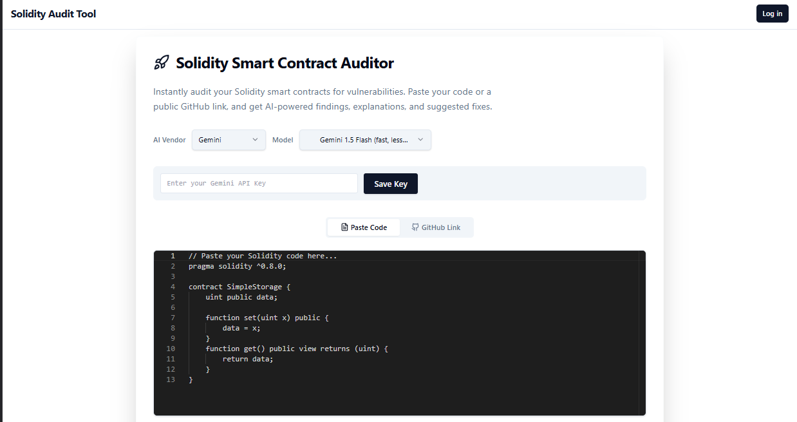

# 🔐 Solidity Insight AI

An AI-powered **Smart Contract Auditor** that instantly reviews Solidity code and detects security vulnerabilities using natural language explanations.

---
  

## 🌐 Live App

Try it now → [solidity-insight-ai.lovable.app](https://solidity-insight-ai.lovable.app)

---

## 📌 What It Does

Just paste your Solidity smart contract into the app, and get:

- ✅ Vulnerability Detection (e.g., reentrancy, unchecked calls)
- 🧠 Line-by-line security analysis
- 💡 Suggested fixes and best practices
- 📄 Markdown-formatted audit summary (ready to share)

All within a simple, clean interface.

---

## 🚀 Tech Stack

- **Frontend**: Next.js + Tailwind CSS  
- **Backend**: OpenAI GPT-4o (via API)
- **Database**: Supabase  
- **Language**: TypeScript  
- **Hosting**: Lovable + Vercel  
- **Dev Style**: Vibe coded 🧃🎧💻


---

## 🧑‍💻 How to Run Locally

1. **Clone the repo**
   ```
   git clone https://github.com/lijnati/solidity-insight-ai
   cd solidity-insight-ai
   ```
2. **Install dependencies**

```
npm install

```
3. **Run the dev server**

```
npm run dev
```

## Contributing
Pull requests welcome! Here's how to help:

Fork the repo

Create your feature branch (git checkout -b feature/YourFeature)

Commit your changes (git commit -m 'Add some feature')

Push to the branch (git push origin feature/YourFeature)

Open a PR